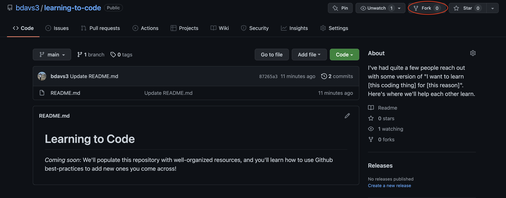
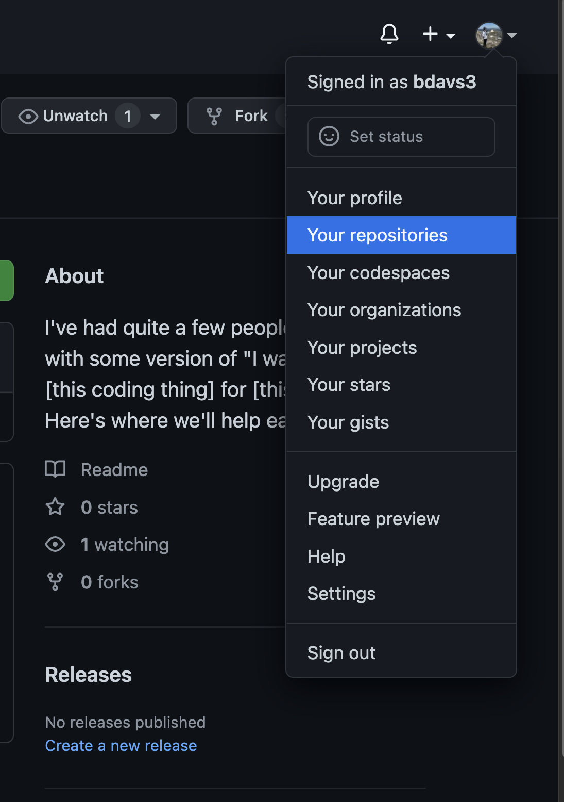
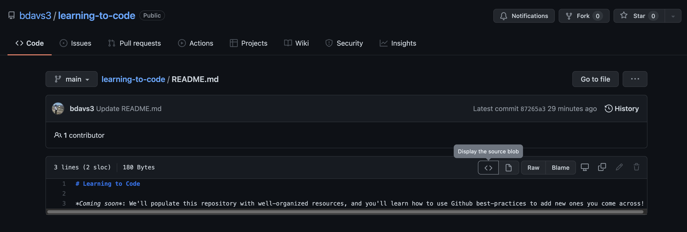

# Learning to Code

**Coming soon**: We'll populate this repository with well-organized resources, and you'll learn how to use Github best-practices to add new ones you come across!

## First Steps

1. If you don't have a Github account, create one.
2. Then, fork this repository. You don't need to know what that means just yet.
3. In `Your repositories`, confirm that you can see `learning-to-code`.

Fork             |  Confirm
:-------------------------:|:-------------------------:
  |  

Hey, by the way, this Markdown file (a lightweight formatting language) is a great first look at some code in action. If you click `README.md` in the file tree above, use the source blob button to take a peek.

